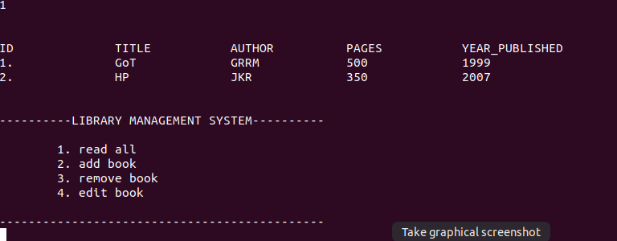
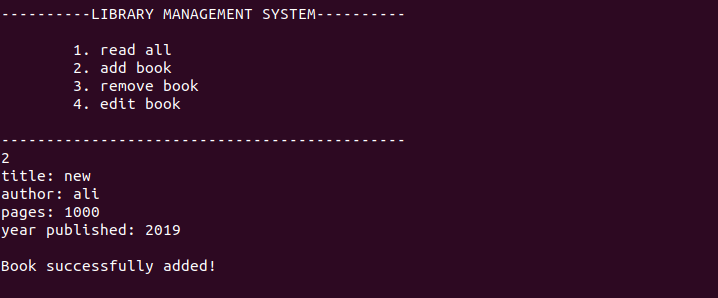
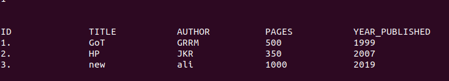

##**Library management system**
***

A project created to learn the fundamentals of C.
&nbsp;

##### Compilation
~~~
gcc main.c src/main_menu.c src/file.c src/library_utils.c -o run
~~~

&nbsp;
##### Screenshots

